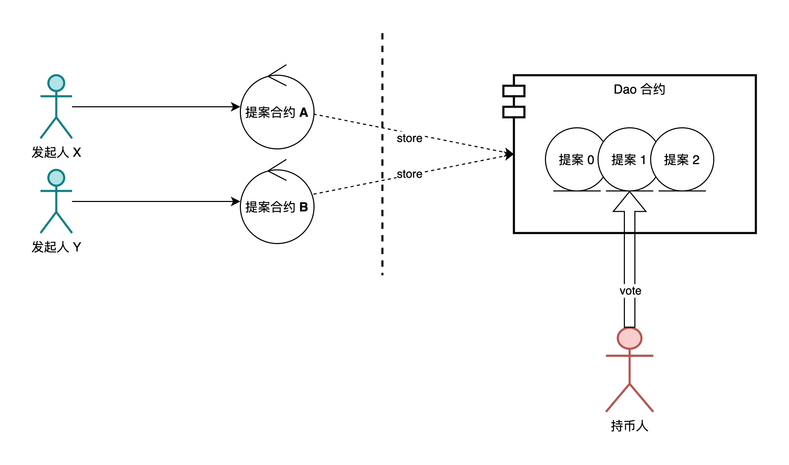

# DAO

## 去中心化组织的探索

DAO 概念的雏形是由 Daniel Larimer 在2013年提出的，将其命名为 DAC（Decentralized Autonomous Corporation）去中心化自治公司，BM（Daniel Larimer 的网名）认为这种新型企业概念与传统企业的区别在于“去中心化”，也就是其内部的组织章程由代码确定，通过公开的代码使得整个企业透明，其加密资产作为企业的股份。 
随后以太坊创始人V神也在自己的博客和杂志上提出了对DAC概念的认知，也在不久之后提出了DAO。

在2015年中V神发布了加密世界的里程碑:智能合约，由此，加密货币不仅仅是作为货币属性流通，同时也可以承载无信任的交易和组织。

区块链物联网公司Sock.it做出了第一次尝试：TheDao ，Sock.it主导设计了TheDao以太坊合约，并于2016年4月30正式部署，随后在2016年5月27日完成了当时世界上最大规模的众筹计划，共筹集1270万枚以太坊。
但是由于合约漏洞，在同年6月17日被黑客攻击并被盗取了大量以太币，这数额巨大的黑客事件也导致了以太坊的硬分叉。
Dao组织最大的一次尝试也就此失败，人们对Dao的去中心化组织概念产生了怀疑，智能合约真的可以支撑起一个全新的组织架构并有着较强的凝聚力么？


## 去中心化组织重获新生

TheDao的尝试虽然以失败告终，但是DAO组织并未因此消失，人们开始总结TheDao失败的原因，一方面由于对DAO的模式的探索还不够深，另一方面是以太坊上的智能合约产生时间不长，编写合约时所产生的安全漏洞较多，也没有较好的调试手段。
综合这两点原因，可以看出TheDao的失败并不是DAO组织的失败，而是由于经验不足导致的。

DAO可以被描述为一个资本化的组织，其中软件协议为其操作提供信息，将自动化置于其中心，将人类置于其边缘。

随着以太坊上的影响力不断扩大，DeFI、NFT、GameFI等层出不穷，人们对智能合约的使用和安全性有了更多的了解。
DAO组织的影响力不断扩大如：MakerDAO使用智能合约自动化抵押贷款，提供了Dai锚定美元的稳定币，以及权益和管理代币MKR，其Dai稳定币已经成为以太坊生态乃至加密世界生态中不可或缺的一环。
还有最近的ConstitutionDAO 宪法DAO，在短短的几天里筹集了3000万美元用来购买一份美国宪法的副本，这是DAO的又一次伟大尝试，人们通过区块链技术可以在短时间内筹集资金，并通过智能合约来完整公开公正的记录。


## Starcoin的DAO模式

Starcoin 作为新兴的公链，依据DAO模式进行维护和升级，将所有权和管理权下放至社区，相对于传统开源社区的管理模式，DAO模式的管理更加科学。

从技术角度来讲，Starcoin的DAO模式使用Starcoin内置的Move虚拟机并使用Move合约语言进行开发，其合约由社区贡献至stdlib标准库中，当Starcoin需要进行升级或改进时，无需依赖其他DAO平台或者投票平台进行投票，用户可以自行使用Starcoin代币STC进行投票治理。

从管理角度来讲，Starcoin通过DAO模式弱化了传统开源社区管理员的概念，项目的发展方向完全由社区决定，每个参与投票的人都可以对每个提案进行判断，并将选票投给自己支持的提案。

同时由于智能合约的公正、公开性，每个提案及其支持者也是透明可查的，不会存在中心化投票所出现的不信任问题。


## 方便的构建DAO模式

Starcoin有着stdlib合约标准库，这可以让合约的安全复用得到一定的保障，不同于solidity，solidity没有标准库的概念，如果不注意引用了恶意的代码库，其后果不堪设想。

在Starcoin构建的项目可以轻松的复用DAO模式进行管理，可以注册自己的项目代币并设置其为治理代币，通过DAO模式来让所有用户实际参与到项目的治理中。


接下来将要介绍该模块的功能以及治理流程。

## DAO 功能

一个基本的 DAO 治理流程大概包括：

- 发起人发起提案。
- 用户投票。
- 提案通过以及执行。




Starcoin 的 DAO 实现与以太坊的 DAO 实现一个最大的区别是：Starcoin 中，每种类型的提案都有一个单独的合约模块去控制，由该模块去实现提案的发起和提案的执行。

这是因为，以太坊中，智能合约可以通过动态分发去调用其他合约接口，因此可以做到一个合约去发起所有类别的提案，只需要在合约内部动态调用即可。
但 Move 是一个函数静态分发调用的模型（这里不多叙述，感兴趣的读者可以阅读 Move 相关的文档），所有的代码调用都必须在编译时确定，做不到动态分发。因此产生了前述的区别。

提案的投票则由 DAO 模块统一负责，DAO 模块对提案做了抽象（实现上，提案是 DAO 模块的一个范型参数），用 `proposal_id` 去标识某个提案，至于提案是什么内容，它不关心，交给用户自己去判断。
投票时，用户通过 DAPP 去获取某个提案的具体内容，然后直接调用 DAO 模块的接口投票，赞成或者反对。

这样可以做到，不同提案可以实现自己的提案逻辑，但又可以共享 DAO 模块的投票功能。

标准库默认提供了以下几种提案：
- ModifyDaoConfigPorposal: 更改 DAO 投票参数的提案。
- OnChainConfigDao: 更改链上参数的提案。
- UpgradeModuleDaoProposal: 升级合约代码的提案。
- TreasuryWithdrawDaoProposal: 从国库中提款的提案。

在发行自己的 Token 时，如有类似需求，用户可以直接接入标准库中的提案，如果有其他更复杂的需求，也可以编写更多的自定义的提案。

## 用户投票

用户投票时，需要质押自己的 Token，票数和 Token 数成正比，即：一币一票。
在投票期，用户可以多次投票，也可以撤回投票，甚至可以倒戈到对方（由赞成变反对，由反对变赞成）。
投票期过后，用户可以立即提回自己质押的 Token。

## 提案通过和执行

投票期过后，如果投票率通过，并且赞成人数多余反对人数，那提案就通过了。
此时，任何人都可以发送交易将提案标识为 **待执行** 状态，放入到队列中，等待执行。
当执行公示期过后，任何人可以发送交易去执行该提案。
提案执行后，提案发起人才可以删除自己的提案，释放提案占用的链上空间。

提案的一个完整生命周期如下：


## 投票状态说明：

```rust
const PENDING: u8 = 1; //等待公示时期
const ACTIVE: u8 = 2;  //正在进行投票
const DEFEATED: u8 = 3; //投票期过后，同意的票数小于等于反对的票数，或者同意的票数小于投票阈值，提案被拒绝 
const AGREED: u8 = 4; //投票期过后，同意的票数大于反对的票数，提案通过
const QUEUED: u8 = 5; //投票通过的提案被放入等待执行队列进行公示，当前公示期为 24 小时
const EXECUTABLE: u8 = 6; //经过公示期后，进入可执行状态。任何人可以触发执行。
const EXTRACTED: u8 = 7; //提案已经执行
```

## DAO模式展望

近来随着DAO模式的不断发展，各种DAO也在逐步的扩大规模，但同时各种由兴趣、好奇、赚取零用钱等理由所形成的DAO也在快速发展，如BanklessDAO、DeveloperDAO 等等。

  BanklessDAO有8000多人的成员，他们根据兴趣爱好、职业技能等等自发的形成了写作、财务、翻译、研究、运营、市场、法律、教育、设计、商务开发、开发、视频、数据分析等公会。
我们可以看到全世界的人可以通过区块链以及智能合约联合起来形成自己的圈子并且通过多种方式来构建同一个项目，这对于传统互联网时期是不敢想象的。


DeveloperDAO通过5000个左右的NFT为纽带，召集喜爱或者关心Web3开发的人进行交流，这同样也是Web3下DAO模式的一次实验。

了解了不同种类的DAO，我们也发现DAO模式适合新时代下的社会组织，各种各样的DAO如雨后春笋般快速发展。
在以往的互联网世界中，人们大多以论坛、即时消息平台作为主要的聚集地。
想成立一个成熟的组织还是比较困难，而DAO的目的是将群聊演变成一个成功驱动的社区，通过智能合约和加密资产的的帮助，DAO模式有更加透明完善的奖惩机制、有着相同目而无关地域的人群、可以更为科学的管理起整个项目，实现对项目的正向推动力。

Token 的去中心化治理已经成为区块链必不可少的一部分。 在 Starcoin 中，可以用 Move 语言方便的实现 DAO 功能。
标准库中内置了一个 DAO 实现，Starcoin 本身也可以通过该模块对各种链上参数进行投票治理。
