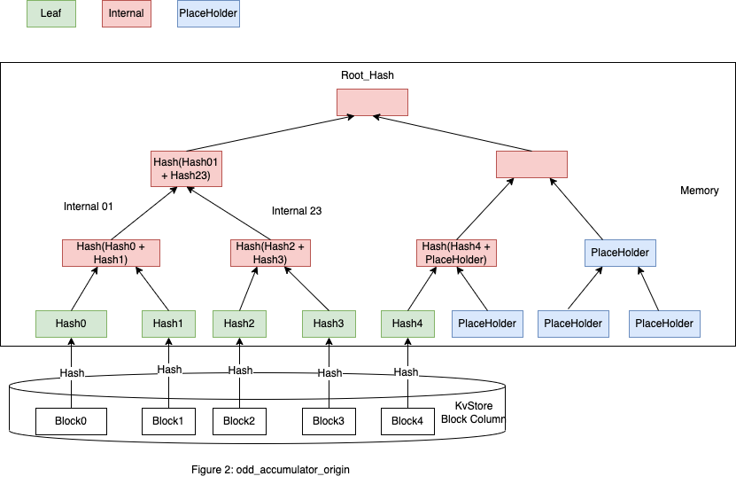
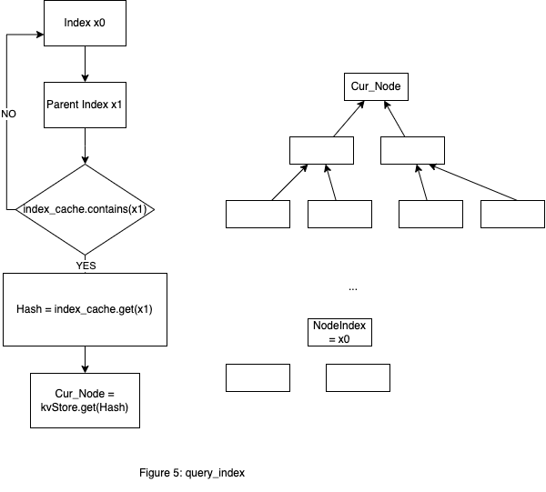

# Accumulator

介绍 Accumulator 之前，先了解下什么是 [Merkle Tree](00-merkletree.md)。
在 Starcoin 中，Accumulator 可以认为是 Merkle Tree 存储在 KvStore 上。

## 用途

这颗树的作用主要是提供 Block，Transaction 的 Merkle Proof，以及通过指序列号获取对应的 Block（ Transaction 类似）。
下面介绍下在 Starcoin 中 Accumulator 的一些信息。

## 节点类型介绍

节点分为三种类型 Leaf，Internal，Empty。
这里以存储 Block 为例子（存储 Transaction类似）。
图1显示了偶数个 Block 组成一个 Accumulator 的情况（这里只有 Leaf 和 Internal）


最下面 Leaf 那层的 Hash0 代表 Block0 的 Hash 值，Hash1 代表 Block1 的值， Hash2，Hash3 类似。
这里 Internal01 的左子树是 Hash0，右子树是 Hash1。
Internal 01 的 Hash01 = Hash(Hash0 + Hash1)，+ 代表拼接字符串。
在 Accumulator 中 Internal 节点的 Hash 值计算方法是左子树 Hash 值和右子树 Hash 值拼接后再 Hash 计算下，Hash 计算的函数是 sha3_256。
这里从 Block0 开始是因为在区块链中有创世块（Genesis Block），最上面的根节点叫做 Root_Hash。



图2显示了奇数个 Block 组成一个 Accumulator 的情况，在图1基础上添加了 Block4，由于 Block4 构建 Internal 需要 Empty 节点来配对，这里 Empty 节点就是 PlaceHolder。
这种情况下要补充多个 PlaceHolder，这里做了些优化，空子树用 PlaceHolder 表示来减少计算， 这里 PlaceHolder 有固定的 Hash 值 ACCUMULATOR_PLACEHOLDER_HASH，如图3。


图3中，`(Hash(Block), Block)` 会按照 Key Value 键值对的形式存在 KvStore 中。
这里给出代码中 Leaf 和 Internal 的定义
```rust
pub enum AccumulatorNode {
    Internal(InternalNode),
    Leaf(LeafNode),
    Empty,
}
pub struct InternalNode {
    index: NodeIndex,
    left: HashValue,
    right: HashValue,
    is_frozen: bool,
}
pub struct LeafNode {
    index: NodeIndex,
    hash: HashValue,
}
```
这里 index 和 is_frozen 在 Internal 和 Leaf 中都不参与Hash计算， NodeIndex 主要用途是 Accumulator 存储在 KvStore 中计算 Internal 用到，后面会介绍。

## 节点的Frozen

Merkle Tree 是在内存中的形式, Accumulator 需要把 Merkle Tree 保存在 KvStore 中。
一种直观的想法就是把把所有的 Leaf 节点保存下来，比如图3中，保存 Hash0，Hash1， Hash2， Hash3， Hash4，还需要保存这些顺序关系。
第一次用的时候计算就可以构建 Merkle Tree，图3中需要计算6次，
当 Leaf 数量比较大的时候，比如`2^23`个 Leaf (大概800万个Block)，需要`2^23`次 sha3_256 计算，这个复杂度是O(N)。
需要加速下计算的过程，注意到 Accumulator 是只添加 Leaf 不会出现删除和更新Leaf的情况，
比如在图3中，Hash0，Hash1，Hash2，Hash3 构建成的子 Accumulator 是 Hash(Hash01 + Hash23)， 再添加新的 Leaf，不会修改根节点 Hash(Hash01 + Hash23) 的 Accumulator。
可以基于这些已经固定的子 Accumulator 进行加速计算。可以发现固定的子 Accumulator 都是满二叉树(Full Binary Tree)。
这里引入了 Frozen 的概念。
PlaceHolder 是not Frozen 的， Leaf 都是 Frozen 的，Internal 的 Frozen 是递归定义，是指左子树和右子树中不含有 PlaceHolder 节点。
一个 Accumulator 中节点数目指所有 Frozen 的节点,在图1中是7个，图3中是8个。
一个 Accumulator 可以通过 Root_Hash 和 frozen_subtree_roots 快速确定下来。
这里定义了 AccumulatorInfo，如下所示
```rust
pub struct AccumulatorInfo {
    /// Accumulator root hash
    pub accumulator_root: HashValue,
    /// Frozen subtree roots of this accumulator.
    pub frozen_subtree_roots: Vec<HashValue>,
    /// The total number of leaves in this accumulator.
    pub num_leaves: u64,
    /// The total number of nodes in this accumulator.
    pub num_nodes: u64,
}
```
在图1中 frozen_subtree_roots 元素只有一个就是 Root_Hash ( accumulator_root )。
图3中有2个都标出来了,他们和 Root_Hash 不同。
这里 frozen_subtree_roots 最多只有64个。
原因如下，假设有n个节点，假设 `2^k <= n < 2^(k + 1)`， 第一个 frozen_subtree 用的节点数是`2^k`，第二个的 frozen_subtree 用的节点数是 `2^k1`，
其中 `2^k1 <= (n - 2^k) < 2^(k1 + 1)`， 可以发现 frozen_subtree_roots 和 n 的二进制表示中的1是对应的，由于 n 定以为64位整数，最多有64个节点数。
HashValue 使用 sha3_256 计算占8个字节，一个 AccumulatorInfo 占的内存最大是`(1 + 64 + 2) * 8`个字节。

## Leaf Index 和 Node Index

如图1中，Hash0-Hash3 是 Merkle Tree 的 Leaf 节点，他们分别对应`0-3`的 Leaf 节点(计数从0开始)
Leaf Index 就是从左开始 Leaf 节点的顺序。Node Index 是中序遍历 Tree 的各个节点的顺序，Hash0-Hash3 对应的 Node Index 是`0,2,4,6`。
简略图如下
```shell
     3
    /  \
   /    \
  1      5 <-[Node Index, in order transver]
 / \    / \
0   2  4   6

0   1  2   3 <[Leaf Index]
```
Node Index 在代码中表示为 NodeIndex 。
这里使用中序遍历的原因可能是 Accumulator 需要将 Merkle Tree 保存到 KvStore 中，由于保存的都是 HashValue，需要知道 HashValue 在 Merkle Tree 中的位置
图3在图1基础上添加一个 Hash4 的节点，中序遍历情况下各个节点的 NodeIndex 值是不变的。

下面介绍下 Accumulator 的一些操作过程

## Accumulator append 过程

```rust
pub fn append(&mut self, new_leaves: &[HashValue]) -> Result<HashValue>
```
上面是对应的代码


流程分为节点的添加和根节点的计算

### 新节点添加

如图4中，Hash0-Hash3 构建的 Accumulator 的 Root_Hash 为 Hash(Internal0123)， 现在添加 Hash4-Hash6。
添加 Hash4 LeafNode， Hash4 添加到 to_freeze，`to_freeze = [Hash4]`，Hash4 为左孩子节点，Hash4 添加完成。
添加 Hash5 LeafNode， Hash5 添加到 to_freeze， `to_freeze = [Hash4, Hash5]`, Hash5 为右孩子节点，需要和其兄弟节点( sibling )生成一个 Frozen 的 Internal 45,
并且添加到 to_freeze， `to_freeze = [Hash4, Hash5, Internal45]`， 这里产生了一个查询 sibling 操作，后面会介绍， Hash5 添加完成。
添加 Hash6 LeafNode， Hash6 添加到 to_freeze，`to_freeze = [Hash4, Hash5, Internal45, Hash6]`, Hash6 为一个左孩子节点，Hash6 添加完成。

### 根节点的计算

根节点的计算会需要用到`NodeIndex, HashValue`的映射，就是下面提到 index_cache。
需要计算下生成的新 Root_Hash 值，Hash6 和 PlaceHolder 生成 Not Frozen Node Internal67， 添加到 not_freeze， `not_freeze = [Internal67]`，
Internal67 和其 sibling 节点 Internal45 (这里会产生查询操作) 生成 Not Frozen Node Internal4567  添加到 not_freeze，`not_freeze = [Internal67, Internal4567]`， 这里会有个查询节点操作，
Internal4567 和其 sibling 节点 Internal0123 (这里会产生查询操作) 生成一个 Not Frozen Node Internal01234567，
添加到not_freeze， `not_freeze = [Internal67, Internal4567, Internal01234567]`， `Hash(Internal01234567)`是新的 Root_Hash。
Starcoin实现中会将 to_freeze, not_freeze 合并起来，并构建`LruCache<NodeIndex, HashValue>`， 这个称为 index_cache , 查询中会用到
图4中 NodeIndex 用蓝色表示。
`index_cache = [(8, Hash4), (10, Hash5), (9, Hash45), (13, Hash(Internal67)), (11, Hash(Internal4567)), (7, HashInternal(Internal01234567))]`。

## Accumulator flush 和 Accumulator 在 KvStore 中的存储

```rust
pub fn flush(&mut self) -> Result<()> 
```
将 append 过程中产生的 to_freeze 和 not_free 合并后按照`(Hash(Node), encode(Node))` Key Value 键值对形式存储在 KvStore 中。
在图4中使用的是 Column BLOCK_ACCUMULATOR，实际还有 Transaction 对应的 Column TRANSACTION_ACCUMULATOR，图中只画了部分 Leaf，Internal。
注意到 Internal 分为 Frozen 和 Not Frozen， 图4中 Internal 67这个 Internal 节点是 Not Frozen 的，如果再添加一个新的 Leaf Hash7会变成 Frozen， 这样会保存
两个不同状态的 Internal67 到 KvStore。

## 查询操作

```rust
fn get_node_hash_always(&mut self, index: NodeIndex) -> Result<HashValue>
```
这是个 private 操作，主要用在 append 流程中，通过 NodeIndex 查找对应的 HashValue。
Accumulator 在 KvStore 中的存储中提到，Column BLOCK_ACCUMULATOR 保存是按照`(Hash(Node)，encode(Node))` Key Value 键值对存储在 KvStore 中，
只能从其父类节点一层层查找，比如查询 NodeIndex x0 (假设为2)的 HashValue，查 NodeIndex x1 (假设为1)的父节点，如果 index_cache 中有，通过其 HashValue 从 KvStore 中获取这个 Node，如果
 index_cache 中没有，找其父节点的父节点，最终肯定能找到(最差的情况是找到 Root_Hash ), 这个节点记为 Cur_Node , 然后再从 Cur_Node 层次遍历找到子孙节点中 NodeIndex 等于 x0 的节点。
流程图见图5



## Accumulator 的幂等性

在 Merkle Tree 中提到记住 Root_Hash 就可以认为是记住了整棵树, 在 Starcoin 中，需要保证 Accumulator 是幂等的。
比如在图3中，我们已经执行了 Block0-4 的计算，这时候又有逻辑把 Block4 添加进来计算，这时候会不会出现添加 Block5 实际是 Block4 的逻辑，实际上不会，由于 Block 的 BlockHeader 存储了前一个 Block 的 Hash 值，
通过前一个 Hash 值就知道整个 Accumulator 的 Leaf 数目为4，对应的子 Accumulator 的 Hash 值是 Hash(Hash01 + Hash23),会和 Hash(Block4) 计算新的 Accumulator，这部分需要结合区块执行来理解。

## Accumulator 中API说明

### 创建 Accumulator

```rust
pub struct MerkleAccumulator {
    tree: Mutex<AccumulatorTree>,
}

impl MerkleAccumulator {
    pub fn new_with_info(
        acc_info: AccumulatorInfo,
        node_store: Arc<dyn AccumulatorTreeStore>,
    ) -> Self;
}
```
new_with_info 通过 AccumulatorInfo 创建新的 Accumulator

### 添加新的元素

```rust
 fn append(&self, leaves: &[HashValue]) -> Result<HashValue>
```
添加新的 LeafNode，这个前面介绍过

### 保存树到 KvStore

```rust
 fn flush(&self) -> Result<()>;
```
将 append 产生的新元素存到 KvStore

### 获取叶子节点

```rust
fn get_leaf(&self, leaf_index: u64) -> Result<Option<HashValue>>;
fn get_leaves(&self, start_index: u64, reverse: bool, max_size: u64) -> Result<Vec<HashValue>>;
```
第一个是获取叶子节点，第二个是批量获取叶子节点

### 获取proof

```rust
fn get_proof(&self, leaf_index: u64) -> Result<Option<AccumulatorProof>> {
```
获取Merkle Proof证明

## 其他琐碎细节

### append 过程中的获取 frozen_subtree_roots

```rust
FrozenSubTreeIterator::new(self.num_leaves)
```
这里是因为 frozen_subtree 和 num_leaves 二进制里的的1对应， 就是找MSB操作(most significant set bit of a u64), 原理参考 Hackers Delight 的 flp 部分
### NodeIndex 相关操作

如果不想研究 NodeIndex 源码，这部分可以不看
NodeIndex 提供了一些操作
(1)通过 LeafCount 计算整个树高
(2)Leaf Index 和 NodeIndex 的转换
(3)获取左子树和右子树 NodeIndex
(4)确定某个 NodeIndex 是否为 PlaceHolder
(5)获取父节点的 NodeIndex
这部分细节待添加。

相关资源[draw.io](../../../../../static/accumulator.drawio)


