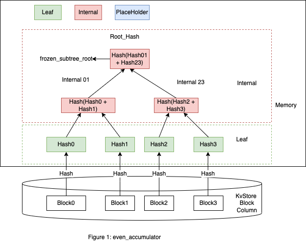

# Accumulator

介绍Accumulator之前，先了解下什么是[Merkle Tree](00-merkletree.md)。
在starcoin中，Accumulator可以认为是Merkle Tree存储在KvStore上。

## 用途
这颗树的作用主要是提供Block，Transaction的Merkle Proof，以及通过指序列号获取对应的Block(Transaction类似)。
下面介绍下在starcoin中Accumulator的一些信息。

## 节点类型介绍
节点分为三种类型Leaf， Internal， Empty。
这里以存储Block为例子(存储Transaction类似)。
图1显示了偶数个Block组成一个Accumlator的情况(这里只有Leaf和Internal)


最下面Leaf那层的Hash0代表Block0的Hash值， Hash1代表Block1的值， Hash2， Hash3类似。
这里Internal01的左子树是Hash0，右子树是Hash1。
Internal 01的Hash01 = Hash(Hash0 + Hash1)， +代表拼接字符串。
在Accumlator中Internal节点的Hash值计算方法是左子树Hash值和右子树Hash值拼接后再Hash计算下，Hash计算的函数是sha3_256。
这里从Block0开始是因为在区块链中有创世块(Genesis Block)，最上面的根节点叫做Root_Hash。


图2显示了奇数个Block组成一个Accumulator的情况，在图1上面增加了Block4， 由于Block4构建Internal需要Empty节点来配对，这里Empty节点就是PlaceHolder。
这种情况下要补充多个PlaceHolder，这里做了些优化，空子树用PlaceHolder表示来减少计算， 这里PlaceHolder有固定的Hash值ACCUMULATOR_PLACEHOLDER_HASH，如图3。


上面这些图中，(Hash(Block), Block)会按照KV对的形式存在KvStore中。
这里给定了Leaf和Internal的定义, 代码参考如下
```rust
pub enum AccumulatorNode {
    Internal(InternalNode),
    Leaf(LeafNode),
    Empty,
}
pub struct InternalNode {
    index: NodeIndex,
    left: HashValue,
    right: HashValue,
    is_frozen: bool,
}
pub struct LeafNode {
    index: NodeIndex,
    hash: HashValue,
}
```
这里index和is_frozen在Internal和Leaf中都不参与Hash计算， NodeIndex主要用途是Accumulator存储在KvStore中用到，后面会介绍

## 节点的Frozen
Merkle Tree是在内存中的形式, Accumulator需要把Merkle Tree保存在KvStore中。
一种直观的想法就是把把所有的Leaf节点保存下来，比如图3中，保存Hash0，Hash1， Hash2， Hash3， Hash4，还需要保存这些顺序关系，
第一次用的时候计算就可以构建Merkle Tree，图3中需要计算6次，也挺快的。
当Leaf数量比较大的时候，比如2^23个Leaf(大概800万个Block,)，需要2^23次sha3_256计算，这个数量级是O(N)的有点慢。
需要加速下计算的过程，这里注意到Accumulator是只添加不会出现删除和更新的情况，
比如在图3中，Hash0，Hash1，Hash2，Hash3构建成的子Accumulator是Hash(Hash01 + Hash23)， 再添加新的Leaf，不会修改根节点Hash(Hash01 + Hash23)的子Accumulator。
可以基于这些已经固定的子Accumulator进行加速计算。可以发现固定的子Accumlator都是满二叉树(Full Binary Tree)。
这里引入了frozen的概念。
PlaceHolder是not Frozen的, Leaf都是Frozen的,  Internal的Frozen是递归定义，是指左子树和右子树中不含有PlaceHolder节点。
一个Accumlator中节点数目指所有frozen的节点,在图1中是7个，图3中是8个。
一个Accumulator可以通过Root_Hash和frozen_subtree_roots快速确定下来。
这里就引入了AccumulatorInfo, 这部分数据结构如下
```rust
pub struct AccumulatorInfo {
    /// Accumulator root hash
    pub accumulator_root: HashValue,
    /// Frozen subtree roots of this accumulator.
    pub frozen_subtree_roots: Vec<HashValue>,
    /// The total number of leaves in this accumulator.
    pub num_leaves: u64,
    /// The total number of nodes in this accumulator.
    pub num_nodes: u64,
}
```
在图1中frozen_subtree_roots元素只有一个就是Root_Hash(accumulator_root)。
图3中有2个都标出来了,他们和Root_Hash不同。
这里我们可以证明frozen_subtree_roots最多只有64个。
证明如下，假设有n个节点，假设 2^k <= n < 2^(k + 1)， 最大的那颗frozen_subtree用的节点数是2^k，第二大的frozen_subtree用的子节点数是2^k1，
其中2^k1 <= (n - 2^k) < 2^(k1 + 1)， 可以发现frozen_subtree_roots和n的二进制表示中的1是对应的，由于n定以为64位整数，最多有64个节点数。
由于HashValue使用sha3_256计算占8个字节，一个AccumulatorInfo占的内存最大是(1 + 64 + 2) * 8个字节。

## Leaf Index 和 Node Index
如图1中，Hash0-Hash3是Merkle Tree的Leaf节点，他们分别对应0-3的Leaf节点(计数从0开始)
Leaf Index就是从左开始Leaf节点的顺序。Node Index是中序遍历Tree的顺序，Hash0-Hash3对应的序号是0,2,4,6。
简略图如下
```shell
     3
    /  \
   /    \
  1      5 <-[Node Index, in order transver]
 / \    / \
0   2  4   6

0   1  2   3 <[Leaf Index]
```
Node Index在代码中对应前面的NodeIndex。
这里使用中序遍历的原因是，Accumulator需要将Merkle Tree保存到KvStore中，由于保存的都是HashValue,需要知道HashValue在Merkle Tree中的位置
图3在图1基础上添加一个Hash4的节点，中序遍历情况下各个节点的NodeIndex值是不变的。

## Accumulator append过程
```rust
pub fn append(&mut self, new_leaves: &[HashValue])
```
上面是对应的代码
### 计算过程

这里以图4为例，Hash0-Hash3构建的Accumulator的Root_Hash为Hash(Internal 0123)， 现在添加Hash4-Hash6。
添加Hash4 LeafNode， Hash4添加到to_freeze，to_freeze = [Hash4]，Hash4为左孩子节点，Hash4添加完成。
添加Hash5 LeafNode， 添加Hash5到to_freeze, to_freeze = [Hash4, Hash5], Hash5为右孩子节点，需要和其兄弟节点(sibling)生成一个Frozen的Internal 45,
并且添加到to_freeze， to_freeze = [Hash4, Hash5, Internal45], 这里产生了一个查询sibling操作，后面会介绍， Hash5添加完成。
添加Hash6 LeafNode， 添加Hash6到to_freeze，to_freeze = [Hash4, Hash5, Internal45, Hash6], Hash6为一个左孩子节点，Hash6添加完成。
需要计算下生成的新Root_Hash值，Hash6和PlaceHolder生成Not Frozen Node Internal67， 记录到not_freeze列表， not_freeze = [Internal67]，
Internal67和其sibling节点Internal45生成Not Frozen Node Internal4567， not_freeze = [Internal67, Internal4567]， 这里会有个查询节点操作，
Internal4567和其sibling节点Internal0123生成一个Not Frozen Node Internal01234567，
记录到not——freeze列表， not_freeze = [Internal67, Internal4567, Internal01234567]， Hash(Internal01234567)是新的Root_Hash。
starcoin实现中

### 存储过程
将to_freeze和not_free按照(Hash(Node), encode(NOde)) Key Value键值对形式存储在KvStore中。
在图4中使用的是Column BLOCK_ACCUMULATOR，实际还有Transaction对应的Column TRANSACTION_ACCUMULATOR，图中只画了部分Leaf，Internal。
注意到Internal分为Frozen和Not Frozen, 图中Internal 67这个Internal节点是Not Frozen的，如果再添加一个新的Leaf Hash7会变成Frozen, 这样会保存
两个不同状态的Internal67到KvStore。前面提到Node Frozen以后就固定下来，个人觉得存储Not Frozen的Internal有点浪费存储空间，再下次添加Hash7需要重新计算
Internal67也不会用到原来状态。

### 查询过程
在


## frozen节点计算Root_Hash
这里是内存相关属性的计算
computer_root_hash根据frozen_subtree_roots计算出root hash,在内存中只操作，在存储中直接将这结构存在block_info或者transaction_info中，
内存计算中append_one被调用过，
KvStore中的还没看
## append流程
Merkle Tree中只使用了append_one
Accumulator中的操作类似append_one的操作, 先生成新的LeafNode, NodeIndex为leaf_pos, 检查是否为right_child,(XXX FIXME, 插入Frozen图, 插入No Frozen图)

FrozenSubTreeIterator讲解(XXX FIXME 这里原理依次找出num_leaves二进制里的的1,most significant set bit of a u64, 原因参考Hackers Delight的flp部分)
)

## KvStore中存储实现
diem中存储的就是NodeIndex -> HashValue的值 (确认下是不是Frozen的才存)

## Accumlator的幂等性
在Merkle Tree中提到记住Root_Hash就可以认为是记住了整棵树, 在starcoin中，需要保证Accumulator是幂等的。
比如在图3中，我们已经执行了Block0-4的计算，这时候又有逻辑把Block4添加进来计算，这时候会不会出现重复添加Block5实际是Block4的逻辑，实际上不会，由于Block的BlockHeader有前一个Block的Hash值，
通过前一个Hash值就知道整个Accumulator的Leaf数目为4，对应的子Accumulator的Hash值是Hash(Hash01 + Hash23),会和Hash(Block4)计算新的Accumlator。

## 查询实现
通过NodeIndex获取HashValue, 检查NodeIndex是否PlaceHolder等等(XXX FIXME， 查找的流程图)
这里主要通过LeafIndexgou'zhao


## NodeIndex实现讲解
如果不想深入源码，这部分可以不看(XXX FIXME)
NodeIndex提供了一些操作
(1)通过LeafCount计算整个树高
(2)


## Accumulator中API说明
下面Leaf和Internal在代码中的定义
```rust
pub struct MerkleAccumulator {
    tree: Mutex<AccumulatorTree>,
}

impl MerkleAccumulator {
    pub fn new_with_info(
        acc_info: AccumulatorInfo,
        node_store: Arc<dyn AccumulatorTreeStore>,
    ) -> Self;
}
```
new_with_info通过API


在[Merkle Tree](merkle_tree.md)中可以提到可以认为有Root_Hash就是有了Accumulator，
但是只有Accumulator对整棵树还是缺失信息，这里AccumulatorInfo添加了一些其他信息。


