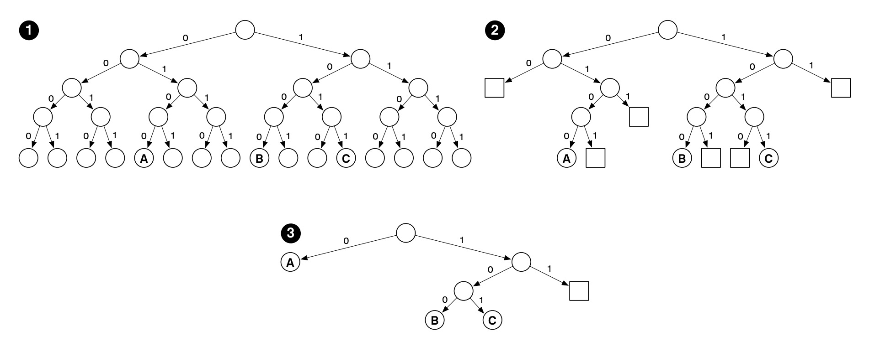

--- 
sidebar_position: 2
---

# Sparse Merkle Tree

要了解为什么用Sparse Merkle Tree(下面简称SMT)，先介绍下Merkle Tree

## Merkle Tree
Merkle Tree又被称为二叉哈希树，主要用在文件系统或者P2P系统中

下面这个图说明下


这里有A, B, C, D四个交易这个虚线框内，在Merkle Tree属于data blocks， 这部分叫做leaf node,

上面的虚线框属于hash pointer,

Hash 1的值是交易A的hash值和交易B的hash值拼接后计算的hash值(也可以有其他算法)，在图中是H(A) H(B) hash(1) = hash(H(A) + H(B)) 这里 + 表示字符串拼接

Hash 2的值是交易C和交易D的hash值拼接后计算的hash值，在图中是H(C) H(D) hash(2) = hash(H(C) + H(D))

Hash 3是Hash 1和Hash 2拼接计算的hash值，在图中是H(AB) H(CD), hash(3) = hash(hash(1) + hash(2)),  Hash 3也叫做top_hash

Merkle Tree有以下作用

### 快速定位修改
如果交易A被修改后，Hash 1也会被修改,top_hash也会被修改，所以可以认为记住top_hash就记住了整个Merkle Tree

### 校验交易
这个树的作用可以检验交易是否有效

在区块链light node不会记录所有交易数据，只会记录Merkle Tree的top_hash值

如果校验交易A是否存在, 这时候是把交易A的hash值这里记为H(A)发送给校验放, 校验方发送一个hash值列表[Hash(B), Hash(CD)]

如果保存的top_hash和hash(hash(H(A) + H(B)) + Hash(CD))相等, 证明交易A是存在的

这个过程叫做Merkle Proof


不同于以太坊个人账户和合约账户是分开的, starcoin中合约中

不同于以太坊外部账号和合约账号是分开的，在starcoin中合约相关都在账号(AccountAddress)对应的状态里面(State)

在合约中包含代码(code)和存储(storage), 这里有点类似C程序中的代码段和数据段

## SMT
### 介绍下为啥需要用SMT

starcoin是基于账户模型，不同于以太坊个人账户和合约账户是分开的, starcoin中合约相关信息也都存储在State中， State包括合约代码(CODE)和存储(RESOURCE)

余额相关信息都在RESOURCE中

需要数据结构来处理账户地址到账户状态的映射，也就是AccountAddree -> State

starcoin中账户地址(AccountAddress) 是128 bit(16个字节), 也就是32个16进制的数(一个16进制的数是4 bit)

直观上来这个映射就是key -> value之间映射，处理这个可以使用HashMap

系统中维护一个全局的HashMap,每次有新的账户创建就插入一对key, value

需要查询账户余额就在HashMap中使用key来查询

不考虑hash碰撞，查询基本是常数时间完成(O(1)),更新也是如此

这种设计最大问题是不能提供Merkel Proof, 比如证明某个时间点这个账户余额大于多少(StateProof)

一种想法是基于当时的HashMap构建Merkel Tree

基于这种想法，每次有新的区块发布的需要基于HashMap构建新的Merkel Tree并将Merkel Tree对应的top_hash发布到BlockHeader中

这个方案是有问题的，HashMap效率很高，但是每次构建Merkel Tree效率很低

还有一种想法是我们不用HashMap，直接构建Merkel Tree把所有账户的状态都存下来

这个方法的问题在于Merkel Tree没有提供高效查找和修改的方法

这里使用了一种基于压缩trie数据结构jellyfish-merkle-tree (JMT)

### SMT设计原理

#### Merkle Tree到SMT

在starcoin中Hash的计算都是基于sha3-256计算来的, 所以这颗树是2的256次方个元素

下图显示了Merkle Tree到SMT的两个优化

这里1显示了Merkel Tree形状，2对其做了优化将空子树用placeholder(方格)代替, 节省了空间

这里3优化将只含有一个叶子节点的子树设置成节点， 这样减少了proof时候对hash的计算

这里A的2进制路径表示为0100, B的为1000， C的为1011

#### 基数树前缀压缩

下图显示了基于压缩的优化

这里图中的Merkle Tree的key的长度都是8个bit，是颗稀疏，有很多空节点

A的2进制路径为00010100， 每4个bit压缩后变成右边的0x14

B的2进制路径为00011010, 压缩后为0x1A

C的2进制路径为00011111, 压缩后为0x1F

D的2进制路径为11101100，压缩后为0xDC

这里每4个bit压缩叫做一个nibble

Merkle Tree可以认为是基数等于2的基数树，图中右边可以认为是基数等于16的基数树

SMT就是基于基数16的基数树(这里简称为Radix16),这个设计的优点就是降低树的高度,减少内存访问次数,降低内存

### SMT数据结构和操作
上面提到SMT实际上是一个Radix16 Trie, 在starcoin中每个key的长度是256bit, 这里基于4个bit(一个nibble)做了压缩,

这样整个树的高度就变为64

SMT的节点类型分为Null, Internal, Leaf

Null就是前面提到的placeholder, Internal最多有16个子节点(子节点类型可以是Internal或者Leaf， 这里对应一个HashMap, key为0-16)， Leaf存储的是实际的key, value

区块链中需要保存历史状态，这里如何查询某个key的历史状态，之前提到Merkle Tree里保存top_hash就认为是保存了整棵树,查询中需要历史key某个状态

需要提供树的根节点值和查询的key，这个根节点就是在block_header中的state_root, 这也是后续讲到statetree的构建需要用到state_root

starcoin中SMT需要持久化到KvStore, 这里用的是RocksDB(测试中MockTreeStore使用的是HashMap + BTreeSet)

为了将整个SMT保存在KvStore中, SMT的所有节点都只存储hash值(对应的内容通过KvStore查询)

例如查找key为Hello对应的value, 在SMT中计算key_hash = sha3_256("hello")

操作都是对key_hash进行

需要将Null, Internal Leaf节点序列化存储在KvStore中

这里说明下starcoin中各种节点实现

```rust
pub struct Child {
    // The hash value of this child node.
    pub hash: HashValue,
    // Whether the child is a leaf node.
    pub is_leaf: bool,
}
pub type Children = HashMap<Nibble, Child>;

pub struct InternalNode {
    // Up to 16 children.
    children: Children,
    //Node's hash cache
    cached_hash: Cell<Option<HashValue>>,
}
pub trait RawKey: Clone + Ord {
    /// Raw key's hash, will used as tree's nibble path
    /// Directly use origin byte's sha3_256 hash, do not use CryptoHash to add salt.
    fn key_hash(&self) -> HashValue {
        HashValue::sha3_256_of(
            self.encode_key()
                .expect("Serialize key failed when hash.")
                .as_slice(),
        )
    }

    /// Encode the raw key, the raw key's bytes will store to leaf node.
    fn encode_key(&self) -> Result<Vec<u8>>;

    fn decode_key(bytes: &[u8]) -> Result<Self>;
}

pub struct LeafNode<K: RawKey> {
    /// The origin key associated with this leaf node's Blob.
    #[serde(
    deserialize_with = "deserialize_raw_key",
    serialize_with = "serialize_raw_key"
    )]
    raw_key: K,
    /// The hash of the blob.
    blob_hash: HashValue,
    /// The blob associated with `raw_key`.
    blob: Blob,
    #[serde(skip)]
    cached_hash: Cell<Option<HashValue>>,
}
```
Child的定义可以看到只存储了hash值，Value通过KvStore.get(hash)获取

下面说明下各个操作流程
### 在空树种创建LeafNode
我们在一颗空树种插入 key "Hello", value "World"

基于这个产生了一个hash值，这个hash值就是新的根节点, hash值和LeafNode序列化后插入到KvStore中


### 插入一些流程
在starcoin中hash值是256bit，画图不方便，这里用短点地址16bit做示范


#### 空树插入叶子
开始为空SMT,插入一个key1, value1, 生成的leafnode1的hash1为0x1234， 这个是新的根节点, 如下图


#### 插入有公共前缀的叶子节点
新插入一个key2, value2, 需要查找key2插入的位置, 先计算key2的key2_hash = hash(key2), 假设key2_hash值为0x1236

key2_hash和root_hash1有公共前缀0x123, 先由 key2, value2生成一个leafnode2, 

由于leafnode1和leafnode2有公共前缀，需要生成一个Internal,记为children1 ,其中 children1[4] = hash(leafnode1), children1[6] = hash(leafnode2),

公共前缀0x1, 0x12也需要生成Internal， 这里先构造0x12的Internal记为children2, children2[3] = hash(children1)

然后构造0x1的Internal children3, children3[2]= hash(children2)

leafnode2, children1, children2, children3都会按照hash和序列化的值写入到kvStore, 新生成的根节点是hash(children3)


#### 插入有公共前缀的Internal节点


## SMT API
### new
```rust
pub fn new(TreeReader: &'a) -> Self {
    
}
```
这里TreeReader是一个trait(可以认为是类似Java中inteface)， 在starcoin中可以认为是提供key value操作的数据结构

在starcoin中就是对应的KVStore这里值RocksDB, MockTreeStore中使用的是HashMap + BTeeSet

有TreeReader就有TreeWriter，分别对应JMT的读写,在starcoin的实现当中MockTreeStore使用了TreeWriter,

持久层并没有实现TreeWriter trait

可以简单认为JMT内存中是一颗trie树，持久化在RocksDB上


### updates
```rust
pub fn updates(&self,
    state_root_hash: Option<HashValue>,
    blob_set: Vec<(KEY, Vec<u8>)>
    ) -> Result<(HashValue, TreeUpdateBatch<KEY>)>;

pub struct StaleNodeIndex {
    pub stale_since_version: HashValue,
    pub node_key: HashValue,
}

pub struct TreeUpdateBatch<KEY> {
    pub node_batch: BTreeMap<HashValue, Node<KEY>>,
    pub stale_node_index_batch: BTreeSet<StaleNodeIndex>,
    pub num_new_leaves: usize,
    pub num_stale_leaves: usize,
}
```
这里HashValue可以认为是一个[u8;32]的数组
这里说明下各个参数

state_root_hash是某个JMT树的hash值，通过hash值唯一确定了这颗JMT树，

blob_set是key, value列表，

这里这么设计是为了一个Block执行交易后满足幂等性 这里state_root_hash等于前一个BlockHeader中的state_root

返回值```Result<(HashValue, TreeUpdateBatch<KEY>)>``` HashValue代表新的JMT的Hash值, 这个新的HashValue存在

Block中Header的state_root

返回值中TreeUpdateBatch 里面的 node_batch, 这里的比如我们blob_set是(key1, value1), 插入的是
key是hash(key1 + value1), value是(key1, value1)

### get_proof_with
```rust
pub fn get_with_proof(&self, key: &K) -> Result<(Option<Vec<u8>>, SparseMerkleProof)>
```
获取key对应的value的值，如果存在并返回对应的merkel proof证明


## 稀疏默克尔树的设计原理

```rust
fn put(key: K, blob: Option<Blob>, tree_cache: &mut TreeCache<R, K>) -> Result<()>
```
这里是存储key，value的写入接口,其中Blob就是vec<u8>,

写入的时候先根据key计算出key对应的HashValue key_hash, 这里HashValue是一个[u8;32]数组,
然后将key_hash转成一个含有64个nibble的元素集合

tree_cache是JMT在内存中缓存的信息，缓存了JMT的root的HashValue值,叫做root_node_key

这里root_node_key可能是NONE,也可能是Block对应的header对应的state_root,

然后读取root_node_key作为key，对应的value值，这里获取可能是从缓存也可能从rocksdb,

这里给个例子
JMT可以支持各种类型的key写入, value就是vec<u8> (被序列化的数据),只需要实现 RawKey
这里假设我们写入key是Hello, value是World,整个JMT是空树
```rust
#[derive(Clone, Debug, Ord, PartialOrd, Eq, PartialEq, Hash)]
pub struct StringKey(pub Vec<u8>);

impl RawKey for StringKey {
    fn encode_key(&self) -> Result<Vec<u8>> {
        Ok(self.0.clone())
    }

    fn decode_key(bytes: &[u8]) -> Result<Self> {
        Ok(StringKey(bytes.to_vec()))
    }
}
let db = MockTreeStringStore::default();
let tree = JellyfishMerkleTree::new(&db);

// Tree is initially empty. Root is a null node. We'll insert a key-value pair which creates a
// leaf node.
let key = StringKey("Hello".as_bytes().to_vec());
let value = Blob::from("World".as_bytes().to_vec());

let (_new_root_hash, batch) = tree.updates(None, vec![(key.into(), Some(value))])?;
assert!(batch.stale_node_index_batch.is_empty());
db.write_tree_update_batch(batch).unwrap();
```

画图LeafNode key, blob, blob_hash, cache_hash() (XXX FIXME)
画图InternalNode hash如何计算(XXX FIXME)

### 空数据插入数据流程 (XXX FIXME)

每次updates会生存一个TreeCache 这个TreeCache记录 root_key， leaf_node的hash值(XXX FIXME) 和 leaf_node

这里先计算key对应的sha3_256 key_hash这个值对应的是0x8ca66ee6b2fe4bb928a8e3cd2f508de4119c0895f22e011117e22cf9b13de7ef

然后将key_hash生成一个64位的nibble

获取JMT树的root_key, 由于是空树,root_key值是个默认值*SPARSE_MERKLE_PLACEHOLDER_HASH,

删掉这个root_key, 创建新的叶子节点leaf_node, 插入新产生的(leaf_node_hash, leaf_node)

这里leaf_node_hash是key的hash和blob的hash拼接后计算的hash值

new_root_key设置为等于leaf_node_hash tree_cache把root_key更新为new_root_key


### put的流程
先生成tree_cache,

从tree_cache中获得root_node_key (XXX FIXME各种情形说明)

获取插入key的hash值，并转换成nibble_iter集合


如果root_node_key是空 走空数据插入流程

如果root_node_key是LeafNode, 通过tree_cache获取root_node_key对应的existing_leaf_node,
比较共同部分,如果是LeafNode直接更新
如果不是Leaf
创建InternalNode，持续创建InternalNode


如果是InternalNode
